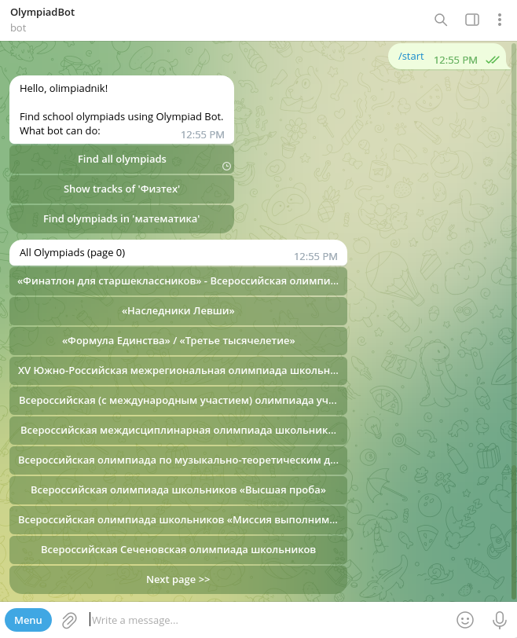
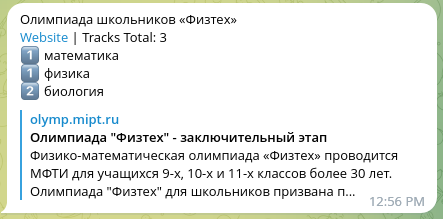
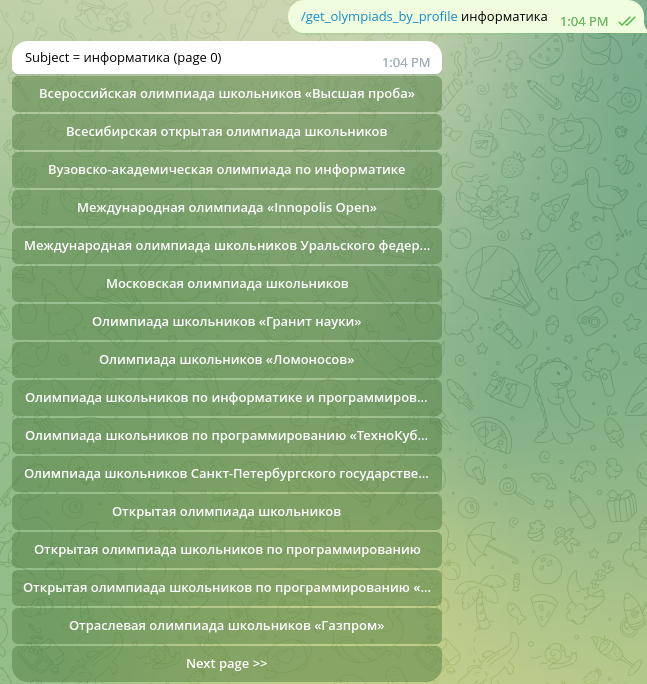

## Olympiad Bot

This bot was developed within 2 days as an exercise for internship at JetBrains.

It uses my [Olympiad API](https://github.com/gvsem/OlympiadAPI) project to provide information about RSOSh school olympiads.

### Settings

You need to provide following environment variables upon starting this bot:

| variable     | description                                             |
|--------------|---------------------------------------------------------|
| WEBHOOK_PATH | You may use `ngrok http 8080` to debug this bot locally |
| BOT_TOKEN    | Take it away from [@BotFather](https://t.me/BotFather)  |
| BOT_USERNAME | Username of your bot, also from `@BotFather`            |